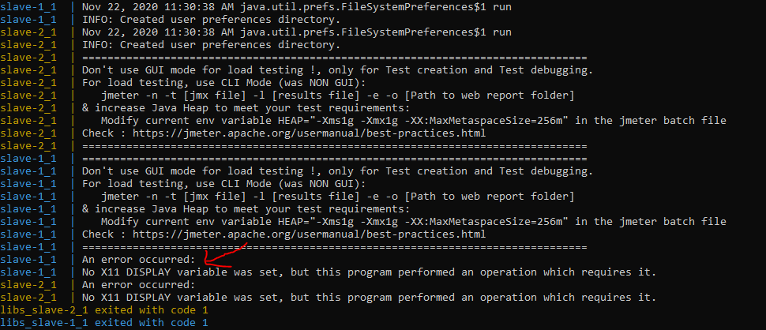

# 상황
* No X11에러 발생


<br>

# 해결
* jmeter을 실행할 때 -n인자를 추가
  * jmeter은 기본적으로 GUI모드로 실행
* Dockerfile 수정
```
FROM jmeterbase:1

EXPOSE 1099 50000

ENTRYPOINT jmeter -n \
-Dserver.rmi.localport=50000 \
-Dserver_port=1099
```

# 참고자료
* stackoverflow: https://stackoverflow.com/questions/56019209/no-x11-display-variable-what-does-it-mean