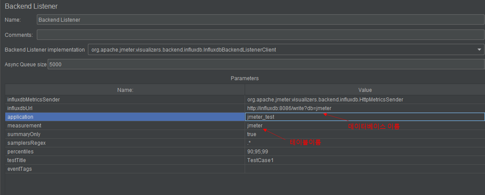
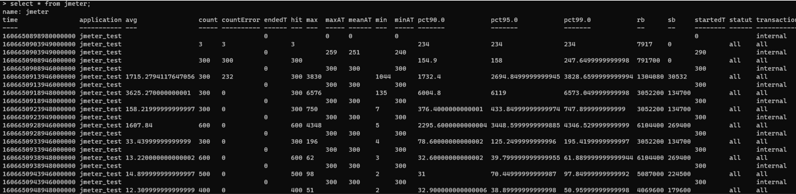

# 데이터베이스 조회
```
show databases
```

# 테이블 조회
* influxdb에서 테이블 개념은 measurement
```
select * from [measurement이름]
```

# Jmeter에서 보낸 데이터를 influxdb에서 조회
```
use jmeter;
select * from jmeter;
```



<br> jmeter백엔드 리스너 설정



<br> influxdb 조회

# 참고자료
* https://musma.github.io/2019/07/08/getting-started-with-influxdb-time-series-database.html