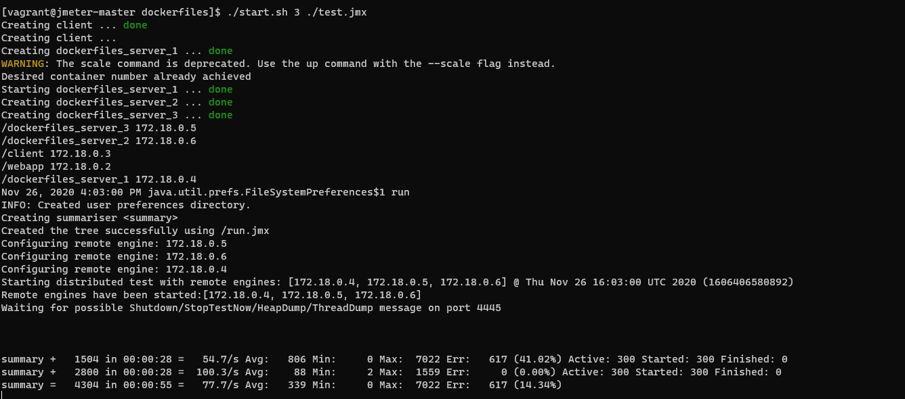

# vagrant_ansible_jmeter
vagrant과 ansible로 jmeter test환경 구축



# 실행방법
* 테스트할 서버의 IP필요
* jmeter jmx파일을 filezila등으로 복사
* influxdb, grafana실행
```
cd /dockerfiles/dashboard/
docker-compose up
```
* 명령어 실행
```sh
chmod +x ./start.sh [슬레이브 수] [jmx경로]
./start.sh
```

# grafana 템플릿
* https://github.com/vishalgoyan/Jmeter_Grafana_Dashboards/blob/master/JMeter%20Dashboard.json

# 참고자료
* [1] 블로그-centos7 install java11: https://phoenixnap.com/kb/install-java-on-centos
* [2] 블로그-ansible handlers: http://oniondev.egloos.com/9978248
* [3] 공식문서-ansible with-items: https://docs.ansible.com/ansible/latest/user_guide/playbooks_loops.html#with-items
* [4] 기업홈페이지-jmeter docker-compose: https://www.blazemeter.com/blog/jmeter-distributed-testing-with-docker
* [5] 블로그-jmeter dockerfile: https://vepo.medium.com/dockerized-jmeter-84228733e306
* [6] 블로그번역-jmeter Dockerfile:  https://xtrimlife.wordpress.com/2016/10/20/jmeter-distributed-load-testing-using-docker-part-1/
* [7] 블로그-ansible docker build: https://www.redhat.com/sysadmin/container-images-ansible
* [8] 블로그-shellscript argv: https://twpower.github.io/131-simple-shell-script-syntax
* [9] 네이버비지니스플랫폼-ansible 설명: https://blog.naver.com/n_cloudplatform/221753934419
* [10] 공식문서: ansible docker module: https://docs.ansible.com/ansible/latest/collections/community/general/docker_image_module.html
* [11] 공식문서: ansible docker-image module: https://docs.ansible.com/ansible/2.3/docker_image_module.html
* [12] 블로그-geturl: https://www.middlewareinventory.com/blog/ansible-get_url-examples-how-to-download-file-from-url/
* [13] JMETER 스크립트 추출: https://www.youtube.com/watch?v=m4bxF756ZGw
* [14] 블로그-jmeter backend listner 설정: https://e3jake.tistory.com/64